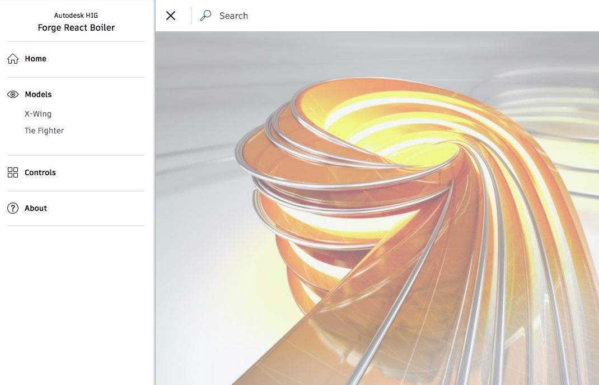

# About that sample

Forge React/Redux boiler for Autodesk HIG

This project was bootstrapped with [Create React App](https://github.com/facebookincubator/create-react-app). Below you will find some information on how to perform common tasks.<br>

You can find the most recent version of this guide [here](https://github.com/facebookincubator/create-react-app/blob/master/packages/react-scripts/template/README.md).



# Setup

 * Development

 ```sh
  npm install or yarn install
  ```
  ```sh
  npm start or yarn start
  ```
 
* Production

 . npm build or yarn build

# About the Author

[https://twitter.com/F3lipek](https://twitter.com/F3lipek)